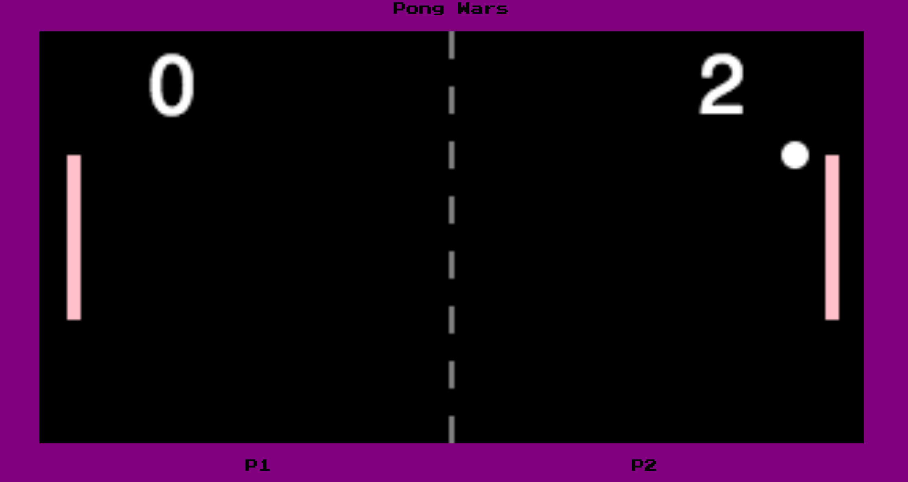

# Pong Game

- Loaded using Webpack

- Use an HTML5 Canvas board to contain the pong game with an initialized board with a background and coloured paddles and ball

- Audio sounds triggered on ball bounces

- Use default import and export on classes 

- Instantiate new objects using new

